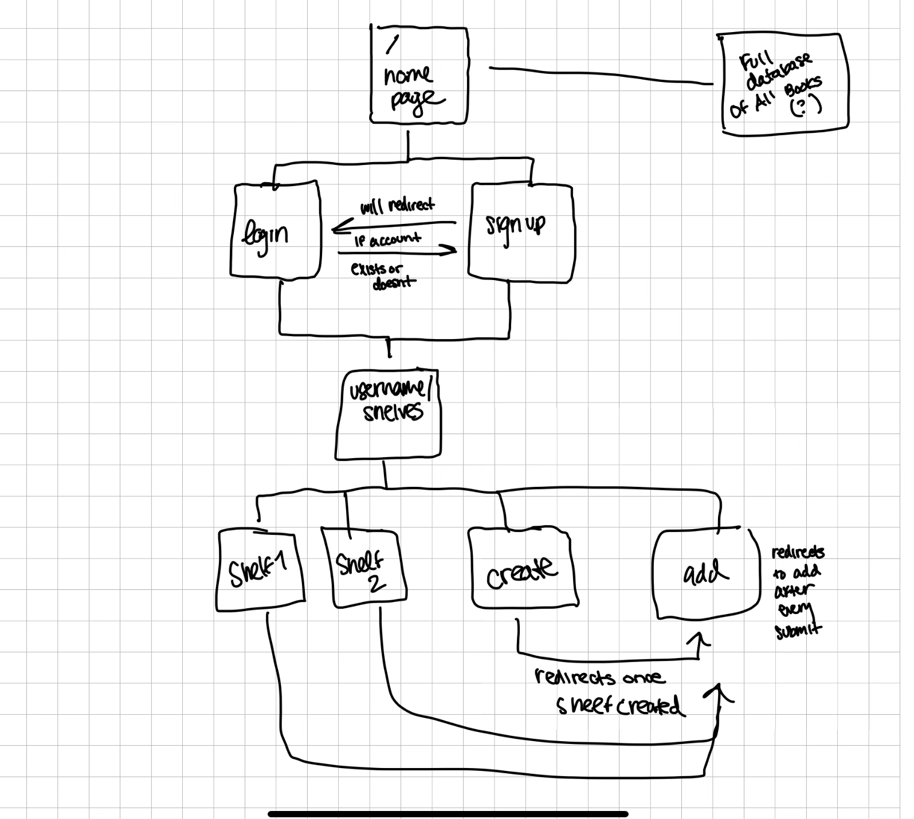

# My Personal Library

## Overview

My Personal Library is a web app that will allow users to keep track of all the books that they have read and/or want to read. It will enable users to have one big list of all the books they want to store as well as custom bookshelves that they can create. The app will also keep track of all the books entered by all users. 

## Data Model

The application will store Users, Bookshelves, and Books

* users can have multiple bookshelves (via references)
* each bookshelf can have multiple books (by embedding)

An Example User:

```javascript
{
  username: "userBook",
  password: // a password hash,
  bookshelves: // an array of references to Bookshelf documents
}
```

An Example Bookshelf with Embedded Books:

```javascript
{
  user: // a reference to a User object
  shelfTitle: "Favorites",
  books: [
    {title: "Pride and Prejudice", author: "Jane Austen", status: "currently reading"},
    {title: "Frankenstein", author: "Mary Shelley", status: "read"},
    {title: "Dracula", author: "Bram Stoker", status: "want to read"},
    {title: "War and Peace", author: "Leo Tolstoy", status: "did not finish"}
  ]
}
```

An Example Book:

```javascript
{
  title: "Pride and Prejudice" // a string title
  author: "Jane Austen", // a string author
  status: //string thats either "want to read", "read", "currently reading", or "did not finish"
}
```

## [Link to Commented First Draft Schema](db.mjs) 

## Wireframes

/ - homepage with link to login and sign up 


/login - login page for users with existing accounts


/signup - sign up page for users without existing accounts


/:username/shelves - page with all of user's shelves


/:username/shelves/:shelfName - page for each shelf 


/:username/shelves/add - page to add to existing shelf 


/:username/shelves/create - page where user creates new shelf


## Site map



## User Stories or Use Cases

1. as non-registered user, I can register a new account with the site
2. as a user, I can log in to the site
3. as a user, I can create a new bookshelf
4. as a user, I can view all of the bookshelves I've created
5. as a user, I can add items to an existing bookshelf
6. as a user, I can view all of my books that I've added

## Research Topics

* (3 points) dotenv
    * used dotenv for configuration management
* (2 points) Bootstrap
    * use bootstrap as CSS framework
* (3 points) bcrypt.js
    * use bcrypt.js for password hashing
* (3 points) Form validation
    * use a javascript library like validate.js to do form validation on login and signup 

10 points total out of 10 required points

## [Link to Initial Main Project File](app.mjs) 

## Annotations / References Used

1. [bcryptjs docs](https://www.npmjs.com/package/bcryptjs)
2. [bootstrap docs](https://getbootstrap.com/docs/5.3/getting-started/introduction/)
3. [validate.js docs](https://validatejs.org/)
